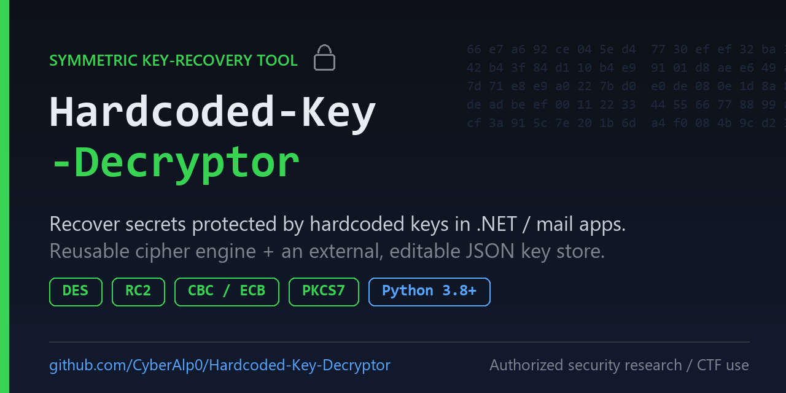

# Hardcoded-Key-Decryptor



A generic symmetric **decrypt / encrypt** tool for recovering secrets from
applications that use **DES or RC2 in CBC (or ECB) mode with PKCS7 padding** and
**hardcoded keys**.

The design separates two things:

- **The engine** (`hardcoded_key_decryptor.py`) — the cipher logic. This never changes.
- **The key store** (`keys.json`) — the key material, kept in an external file
  so you can add your own recovered keys without touching the code.

> **Disclaimer**
> For educational use, authorised security research, and CTF write-ups against
> systems you own or are explicitly permitted to test. Do not use it against
> systems you do not have permission to access, and do not commit real recovered
> keys or secrets from third-party products to a public repository.

---

## What it's for

Many applications encrypt stored secrets (passwords in config files, database
fields, etc.) with a symmetric cipher whose **key is baked into the application
binary**. Once you decompile the binary and recover that key, the "secret" is no
longer secret — the protection depended entirely on the key staying hidden.

This tool gives you:

- A correct, reusable implementation of the DES/RC2 + CBC/ECB + PKCS7 scheme
  those applications commonly use.
- An external, editable list of keys, one **profile** per target, that you fill
  in yourself from whatever binary you are analysing.

The tool ships with **blank placeholder profiles only** — you supply the keys.

---

## Requirements

- **Python 3.8+**
- The [`cryptography`](https://pypi.org/project/cryptography/) library
  (version 43+ recommended — DES/RC2 live in its `decrepit` module).

```bash
pip install -r requirements.txt
# on Debian/Kali/Parrot you may need:
pip install cryptography --break-system-packages
```

---

## Files

| File               | Purpose                                                                       |
|--------------------|-------------------------------------------------------------------------------|
| `hardcoded_key_decryptor.py`   | The tool (cipher engine + CLI).                                               |
| `keys.json`        | The external key store. **Edit this** — it ships with blank example profiles. |
| `requirements.txt` | Python dependency.                                                            |

### The default `keys.json` is empty on purpose

`keys.json` ships with two **placeholder** profiles (`example-des-cbc`,
`example-rc2-cbc`) whose keys are all zeros. They exist only to show the format.
Replace them with your own recovered keys, or delete them. The file documents
itself: open it and read the `_instructions` block at the top. Any field whose
name starts with `_` is a comment and is ignored by the tool.

---

## Usage

```
python3 hardcoded_key_decryptor.py [options] VALUE
```

### Options

| Option              | Description                                                        |
|---------------------|--------------------------------------------------------------------|
| `VALUE`             | Value to process (Base64 for decrypt, plain text for encrypt).     |
| `-d`, `--decrypt`   | Decrypt mode (default).                                            |
| `-e`, `--encrypt`   | Encrypt mode.                                                      |
| `-k`, `--keys`      | Path to the key file (default: `keys.json`).                      |
| `-p`, `--profile`   | Use a specific named profile from the key file.                   |
| `--list`            | List available profiles and exit.                                 |
| `-m`, `--method`    | Cipher for custom `--key/--iv` mode: `des` (default) or `rc2`.     |
| `--mode`            | Cipher mode for custom mode: `cbc` (default) or `ecb`.            |
| `--key`             | Custom key as hex (e.g. `"AA BB CC DD EE FF 00 11"`). Needs `--iv`.|
| `--iv`              | Custom IV as hex. Needs `--key`.                                   |

If you specify neither a `--profile` nor a custom `--key/--iv`, the tool tries
**every profile** in the key file and prints each result. The correct one
produces readable text; the wrong ones produce garbage.

### Examples

List the profiles you have:

```bash
python3 hardcoded_key_decryptor.py --list
```

Decrypt a value using a specific profile:

```bash
python3 hardcoded_key_decryptor.py -d "<base64-ciphertext>" -p my-profile
```

Decrypt while trying every profile in the key file automatically:

```bash
python3 hardcoded_key_decryptor.py "<base64-ciphertext>"
```

Decrypt with a custom key/IV, no profile needed:

```bash
python3 hardcoded_key_decryptor.py -d "<base64-ciphertext>" \
    --key "AA BB CC DD EE FF 00 11" --iv "11 22 33 44 55 66 77 88"
```

Encrypt a plaintext (handy to confirm you match an observed ciphertext):

```bash
python3 hardcoded_key_decryptor.py -e "some plaintext" -p my-profile
```

Use a key file stored elsewhere:

```bash
python3 hardcoded_key_decryptor.py -k /path/to/other-keys.json "<base64-ciphertext>"
```

---

## The key file format

A key file holds a `profiles` object. Each profile is one key set:

```json
{
  "profiles": {
    "my-profile-name": {
      "description": "where these keys came from",
      "method": "des",
      "mode": "cbc",
      "key": "AA BB CC DD EE FF 00 11",
      "iv":  "11 22 33 44 55 66 77 88"
    }
  }
}
```

Fields per profile:

- `description` — free text shown by `--list`. Note the source here.
- `method` — `des` (8-byte key/IV) or `rc2` (usually 5-8 bytes).
- `mode` — `cbc` (needs an `iv`) or `ecb` (`iv` ignored).
- `key` / `iv` — hex bytes. Spaces, commas, or `0x` prefixes are all accepted.

> JSON has no native comment syntax, so this project uses `_`-prefixed keys
> (`_instructions`, `_comment`) as comments. The tool ignores any field whose
> name starts with `_`, so the file can document itself and still be valid JSON.

### Adding a new target

1. Decompile the target binary and find its crypto/helper class.
2. Recover the key and IV byte arrays, and note the cipher (`des`/`rc2`) and
   mode (`cbc`/`ecb`).
3. Add a profile to `keys.json` with those bytes.
4. Run the tool with `-p your-profile`, or let it auto-try everything.

No code changes needed.

---

## How it works, step by step (decrypt)

1. **Base64 decode** the input to raw ciphertext (missing `=` padding is fixed).
2. **Build the cipher** — DES (implemented as single-key TripleDES, which is
   identical) or RC2, in the chosen mode.
3. **Decrypt** the ciphertext.
4. **Strip PKCS7 padding**.
5. **Decode** the result as UTF-8.

---

## Notes & limitations

- **DES via TripleDES:** modern `cryptography` doesn't expose single DES
  directly, so the engine uses `TripleDES` with an 8-byte key. 3DES with one
  repeated key is mathematically identical to DES.
- **Key-derivation branches:** some applications derive a key from a passphrase
  (e.g. .NET's `PasswordDeriveBytes` / PBKDF1) instead of using a fixed byte
  array. This tool handles fixed keys and raw key/IV input, not on-the-fly
  derivation. If a target uses a derivation branch, precompute the resulting
  key/IV and add them as a profile.
- **Block size** is assumed to be 8 bytes (true for DES and RC2), which the
  PKCS7 logic relies on.

---

## License

Released under the [MIT License](LICENSE). Copyright (c) 2026 CyberAlp0.
Provided as-is for educational and research use, with no warranty.
